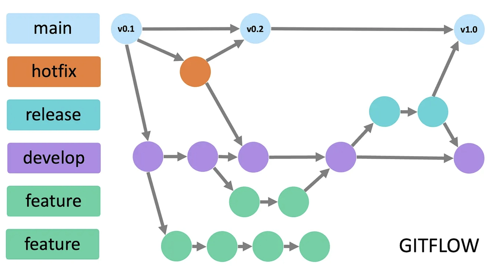
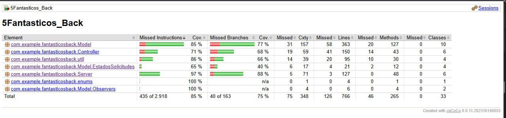
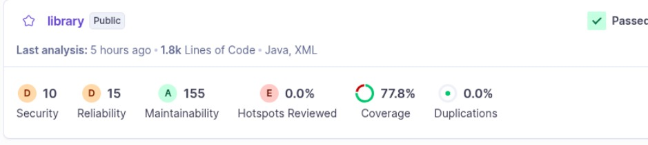

# 5Fantasticos_Back

### Proyecto SIRHA 🎓

- **Rama:** `develop`
- **GitHub:** https://github.com/JulianCReal/5Fantasticos_Back

## 👥 Desarrolladores
- KAROL ESTEFANY ESTUPIÑAN VIANCHA 
- SERGIO ALEJANDRO IDARRAGA TORRES 
- JULIAN DAVID CASTIBLANCO REAL 
- SANTIAGO CARMONA PINEDA 
- JUAN CARLOS LEAL CRUZ

---

# 🚀 Estrategia de Versionamiento y Branching

## 📋 Tabla de Contenidos
- [🌳 Estrategia de Ramas (Git Flow)](#-estrategia-de-ramas-git-flow)
- [🏷️ Tipos de Ramas](#️-tipos-de-ramas)
- [📝 Convenciones de Nomenclatura](#-convenciones-de-nomenclatura)
- [💬 Convenciones de Commits](#-convenciones-de-commits)

---

## 🌳 Estrategia de Ramas (Git Flow)

> Utilizamos **GitFlow**, un modelo de ramificación robusto que nos permite mantener un desarrollo organizado y controlado.



### ¿Por qué GitFlow?
- ✅ **Desarrollo paralelo:** Múltiples funcionalidades simultáneamente
- ✅ **Releases controlados:** Versiones estables y predecibles  
- ✅ **Hotfixes rápidos:** Corrección inmediata de bugs críticos
- ✅ **Historial limpio:** Trazabilidad completa del código

---

## 🏷️ Tipos de Ramas

### 🎯 `main`
> **Rama de producción** - Código estable y listo para despliegue

| **Aspecto** | **Descripción** |
|-------------|-----------------|
| **🎯 Propósito** | Rama estable con versión final (producción/demo) |
| **📥 Recibe de** | `release/*` y `hotfix/*` únicamente |
| **🏷️ Tags** | Cada merge crea un tag SemVer (`vX.Y.Z`) |
| **🔒 Protección** | PR obligatorio + 1-2 aprobaciones + CI verde |

### 🔧 `develop`  
> **Rama de integración** - Base para nuevas funcionalidades

| **Aspecto** | **Descripción** |
|-------------|-----------------|
| **🎯 Propósito** | Integración continua de trabajo en desarrollo |
| **📥 Recibe de** | `feature/*` y merges de `release/*` |
| **🔒 Protección** | Mismas reglas que `main` |

### ⚡ `feature/*`
> **Ramas de funcionalidad** - Desarrollo de nuevas características

| **Aspecto** | **Descripción** |
|-------------|-----------------|
| **🎯 Propósito** | Desarrollo de funcionalidades, refactors o spikes |
| **🌱 Base** | `develop` |
| **🔄 Cierre** | Merge a `develop` mediante PR |

### 🚀 `release/*`
> **Ramas de preparación** - Estabilización pre-despliegue

| **Aspecto** | **Descripción** |
|-------------|-----------------|
| **🎯 Propósito** | Congelar cambios, testing final, correcciones menores |
| **🌱 Base** | `develop` |
| **🔄 Cierre** | Merge a `main` (con tag) **Y** merge a `develop` |
| **📝 Ejemplo** | `release/1.3.0` |

### 🔥 `hotfix/*`
> **Ramas de emergencia** - Corrección urgente de bugs críticos

| **Aspecto** | **Descripción** |
|-------------|-----------------|
| **🎯 Propósito** | Corregir bugs **críticos** en producción |
| **🌱 Base** | `main` |
| **🔄 Cierre** | Merge a `main` (con tag PATCH) **Y** merge a `develop` |
| **📝 Ejemplos** | `hotfix/fix-login-crash` |

---

## 📝 Convenciones de Nomenclatura

### 🌟 **Feature Branches**

```bash
feature/[nombre-funcionalidad]-sirha_[codigo-jira]
```

**Ejemplos:**
```bash
✅ feature/login-validation-sirha_34
✅ feature/student-dashboard-sirha_67  
✅ feature/api-optimization-sirha_89
```

**Reglas:**
- 🔤 **kebab-case** (palabras separadas por guiones)
- 📏 Máximo **50 caracteres**
- 📋 Descripción **clara y específica**
- 🎫 Código Jira **obligatorio** para trazabilidad

### 🚀 **Release Branches**

```bash
release/[version]
```

**Ejemplos:**
```bash
✅ release/1.3.0
✅ release/2.0.0-beta
```

### 🔥 **Hotfix Branches**

```bash
hotfix/[descripcion-breve-del-fix]
```

**Ejemplos:**
```bash
✅ hotfix/fix-login-crash
✅ hotfix/security-patch
✅ hotfix/database-connection-error
```

---

## 💬 Convenciones de Commits

### 📐 **Formato Estándar**

```bash
[codigo-jira] [tipo]: [descripción específica de la acción]
```

### 🏷️ **Tipos de Commit**

| Tipo | Emoji | Descripción | Ejemplo |
|------|-------|-------------|---------|
| `feat` | ✨ | Nueva funcionalidad | `34-feat: agregar validación de email` |
| `fix` | 🐛 | Corrección de errores | `35-fix: corregir error de navegación` |
| `docs` | 📚 | Cambios en documentación | `36-docs: actualizar README` |
| `style` | 💄 | Formato/estilo (no funcional) | `37-style: mejorar indentación CSS` |
| `refactor` | ♻️ | Refactorización sin cambios funcionales | `38-refactor: optimizar función login` |
| `test` | 🧪 | Agregar o modificar tests | `39-test: agregar tests unitarios` |
| `chore` | 🔧 | Tareas de mantenimiento | `40-chore: actualizar dependencias` |

### ✅ **Buenos Ejemplos**
```bash
git commit -m "26-feat: agregar validación de email en formulario login"
git commit -m "24-fix: corregir error de navegación en header mobile"  
git commit -m "28-test: agregar tests unitarios para servicio usuario"
git commit -m "30-docs: actualizar documentación de API endpoints"
```

### ❌ **Ejemplos a Evitar**
```bash
git commit -m "23-feat: agregar login"           # Muy genérico
git commit -m "24-fix: arreglar bug"             # Sin contexto
git commit -m "cambios varios"                   # Sin código Jira ni tipo
```

### 📋 **Reglas de Commits Específicos**

| # | Regla | Descripción |
|---|-------|-------------|
| 1 | **Un commit = Una acción** | Cada commit representa un cambio lógico completo |
| 2 | **Máximo 72 caracteres** | Legible en todas las herramientas Git |
| 3 | **Usar imperativo** | "agregar", "corregir" (no "agregado", "corrigiendo") |
| 4 | **Ser descriptivo** | Especificar QUÉ se cambió y DÓNDE |
| 5 | **Commits frecuentes** | Muchos commits pequeños > pocos grandes |

### 🎯 **Beneficios de Commits Específicos**

- 🔄 **Rollback preciso:** Revertir solo la parte problemática
- 🔍 **Debugging eficiente:** Identificar cuándo se introdujo un bug  
- 📖 **Historial legible:** Entender la evolución del código
- 🤝 **Colaboración mejorada:** Reviews más fáciles y claras

---

## Diagramas

- Diagrama de base de datos:
  
  - El diagrama representa el modelo de datos de un sistema académico basado en documentos NoSQL. Se definen entidades principales como User, de la cual heredan Student y Teacher, además de Department, Group, Subject y Petition. Cada entidad cuenta con su respectiva colección en formato de documento, donde se almacenan atributos como identificadores, nombres, códigos, materias, grupos y observaciones.
  
  - Las relaciones muestran que los estudiantes y profesores pertenecen a departamentos; los profesores dictan materias y grupos; los estudiantes cursan asignaturas y pueden generar peticiones relacionadas con cambios o solicitudes académicas. En conjunto, el modelo busca organizar y gestionar de forma estructurada la información académica de usuarios, departamentos, materias y procesos administrativos.


- Diagrama casos de uso:
  
- El diagrama de casos de uso representa las funcionalidades del sistema SIHRA App y los actores que interactúan con él. Los estudiantes pueden registrarse en la plataforma, consultar sus horarios, ver el semáforo académico, crear y dar seguimiento a solicitudes, así como inscribir materias y consultar la capacidad de los grupos. La decanatura gestiona procesos como la aprobación de casos excepcionales, la consulta de información de los estudiantes, la disponibilidad de grupos, los horarios y solicitudes, además de configurar periodos de inscripción. Los profesores tienen acceso a la información de los estudiantes, mientras que el administrador se encarga de registrar usuarios, asignar profesores a grupos, administrar horarios y modificar cupos. En conjunto, el sistema centraliza la gestión académica y administrativa para mejorar el control de los procesos universitarios.


- Diagrama de contexto:
 
- El diagrama de contexto muestra al sistema Sirha como el núcleo que centraliza la información académica y administrativa. Los estudiantes pueden visualizar sus horarios, avances académicos y realizar solicitudes. Los administrativos gestionan la asignación de salones y franjas horarias, además de acceder a la información de los estudiantes. Las decanaturas revisan solicitudes, habilitan cupos y realizan los procedimientos correspondientes. Finalmente, los profesores consultan los horarios de sus clases y de sus alumnos.


- Diagrama de clases:
  
- El diagrama de clases representa la estructura del sistema Sirha, mostrando las entidades principales y sus relaciones. Se incluyen clases académicas como Estudiante, Profesor, Decanatura, Administrador, Materia, Grupo, Carrera, Horario, SemáforoAcadémico y Solicitud, que permiten gestionar la información de los usuarios, las asignaturas, los horarios y los procesos académicos. En conjunto, el modelo organiza la lógica del sistema y facilita la administración de los recursos académicos y las solicitudes de los estudiantes.


- Diagrama de secuencia:
  
  
  Los diagramas de secuencia representan la interacción entre los distintos objetos o actores del sistema a lo largo del tiempo. En ellos se muestran los mensajes que se envían entre las entidades y el orden en que ocurren, lo que permite visualizar cómo se desarrolla un proceso específico dentro del sistema. Cada objeto se representa con una línea de vida vertical, mientras que las flechas indican la comunicación o invocación de métodos.
  En el caso del sistema Sirha, los diagramas de secuencia permiten describir escenarios como el registro de un estudiante, la creación de una solicitud, la consulta de horarios o la gestión de cupos, mostrando paso a paso cómo interactúan los estudiantes, profesores, administrativos y decanaturas con el sistema para completar dichas acciones.


- Diagrama de componentes General:
  
  El diagrama de componentes del sistema SIRHA muestra cómo está organizada la arquitectura de la aplicación. En primer lugar, se encuentra el Frontend SIRHA, desarrollado con tecnologías como React, TypeScript y Figma, encargado de la interfaz gráfica que usan los estudiantes y administrativos. Este frontend se comunica con el Backend SIRHA, implementado con Java y Spring, apoyado en herramientas como Maven, Docker, SonarQube, Swagger y Jacoco para la gestión de dependencias, despliegue, control de calidad y documentación de servicios. Finalmente, el backend interactúa con la base de datos MongoDB (5-Fantásticos-SIRHA MongoDB), donde se almacena y gestiona la información académica y administrativa del sistema.


- Diagrama de componentes Especifico:
  
  El diagrama de componentes específico del backend de SIRHA detalla cómo están organizados los módulos internos del sistema. Cada entidad principal (Decanatura, Materia, Profesor y Estudiante) cuenta con su propio flujo compuesto por Controller, Service y Repository, lo que sigue la arquitectura por capas típica en aplicaciones con Spring.

## Prebas del funcionamiento del api est
A continuación se presentan videos que muestran el funcionamiento de los diferentes métodos del API, incluyendo ejemplos de solicitudes POST y GET, así como el proceso de autenticación.
Son hipervínculos que llevan a los videos alojados en YouTube.

**Video métodos POST**

[](https://youtu.be/fVzrYhhFVuE)
**Video métodos GET**

[](https://youtu.be/XOMNDiEAiiY)


**Video de autenticación**

[](https://youtu.be/NoaxL3vf8rw)


## Documentación Swagger

  - **Pantallazos:**
    
    
    
    
    
    


## Informes estáticos y dinámicos

  - **Jacoco y sonarQube**
  - 
  - 


   
